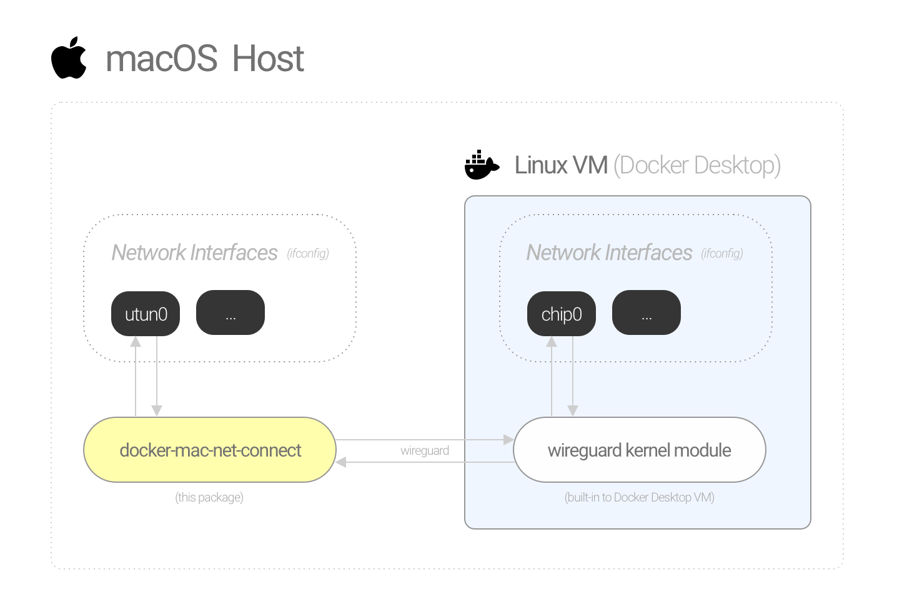

# Docker Mac Net Connect

> Connect directly to Docker-for-Mac containers via IP address.

## Features

- **L3 connectivity:** Connect to Docker containers from macOS host (without port binding).
- **Lightweight:** Based on WireGuard (built-in to Linux kernel).
- **Hands-off:** Install once and forget. No need to re-configure every time you restart your Mac or Docker daemon.
- **Automatic:** Docker networks are automatically added/removed from macOS routing table.
- **No bloat:** Everything is handled by a single binary. No external dependencies/tools are needed.

## Requirements
You must be using Docker Desktop v3.6.0 or higher to use this tool (see https://github.com/chipmk/docker-mac-net-connect/issues/10#issuecomment-1146662058).

## Installation

```bash
# Install via Homebrew
$ brew install chipmk/tap/docker-mac-net-connect

# Run the service and register it to launch at boot
$ sudo brew services start chipmk/tap/docker-mac-net-connect
```

## Usage

After installing, you will be able to do this:

```bash
# Run an nginx container
$ docker run --rm --name nginx -d nginx

# Get the internal IP for the container
$ docker inspect nginx --format '{{.NetworkSettings.IPAddress}}'
172.17.0.2

# Make an HTTP request directly to its IP
$ curl -I 172.17.0.2
HTTP/1.1 200 OK
Server: nginx/1.21.3
Date: Thu, 11 Nov 2021 21:00:37 GMT
Content-Type: text/html
Content-Length: 615
Last-Modified: Tue, 07 Sep 2021 15:21:03 GMT
Connection: keep-alive
ETag: "6137835f-267"
Accept-Ranges: bytes
```

## Background

Accessing containers directly by IP (instead of port binding) can be useful and convenient.

### Problem

Unlike Docker on Linux, Docker-for-Mac does not expose container networks directly on the macOS host. Docker-for-Mac works by running a Linux VM under the hood (using [`hyperkit`](https://github.com/moby/hyperkit)) and creates containers within that VM.

Docker-for-Mac supports connecting to containers over Layer 4 (port binding), but not Layer 3 (by IP address).

### Solution

Create a minimal network tunnel between macOS and the Docker Desktop Linux VM. The tunnel is implemented using WireGuard.

### Why WireGuard?

WireGuard is an extremely lightweight and fast VPN. It’s also built in to the Linux kernel, which means no background processes/containers are required. It is the perfect tool for this application.

## How does it work?



### macOS side

A lightweight customized WireGuard server (_`docker-mac-net-connect`_) runs on your macOS host and creates a virtual network interface (`utun`) that acts as the link between your Mac and the Docker Desktop Linux VM.

### Linux VM side

Since WireGuard is built into the Linux kernel, all we need to do is configure the VM with a virtual network interface that links to the macOS host. No background processes or containers are required.

How do we configure the VM? A one-time container is deployed with just enough privileges to configure the Linux host’s network interfaces (`—-cap-add=NET_ADMIN` + `-—net=host`).

The container creates the interface, configures WireGuard, then exits and is destroyed. The WireGuard interface continues working after the container is gone because it was created on the Linux host’s network namespace, not the container’s.

### Tying it together

The server on macOS monitors your Docker container networks and automatically adds their subnets to your macOS routing table (routing through the `utun` interface). Now you can connect to any container directly by it’s IP address from your macOS host. Eg.

```bash
# Run an nginx container
$ docker run --rm --name nginx -d nginx

# Get the internal IP for the container
$ docker inspect nginx --format '{{.NetworkSettings.IPAddress}}'
172.17.0.2

# Make an HTTP request directly to its IP
$ curl -I 172.17.0.2
HTTP/1.1 200 OK
Server: nginx/1.21.3
Date: Thu, 11 Nov 2021 21:00:37 GMT
Content-Type: text/html
Content-Length: 615
Last-Modified: Tue, 07 Sep 2021 15:21:03 GMT
Connection: keep-alive
ETag: "6137835f-267"
Accept-Ranges: bytes
```

## Other Solutions

Other great solutions have been created to solve this, but none of them are as turn-key and lightweight as we wanted.

- **[docker-tuntap-osx](https://github.com/AlmirKadric-Published/docker-tuntap-osx)**

  - Requires installing third party `tuntap` kernel extension
  - Requires manually re-running a script every time the Docker VM restarts to bring the network interface back up
  - Docker network subnets have to be routed manually

- **[docker-mac-network](https://github.com/wojas/docker-mac-network)**

  - Requires installing an OpenVPN client (ie. `Tunnelblick`)
  - Requires an OpenVPN server container to be running at all times in order to function
  - Docker network subnets have to be routed manually

## FAQ

### Is this secure?

This tool piggybacks off of WireGuard which has gone through numerous audits and security tests (it is built-in to the Linux kernel after all). The `docker-mac-net-connect` server generates new private/public key pairs for each WireGuard peer every time it runs. No values are hard-coded.

Network traffic runs directly between the macOS host and local Linux VM - no external connections are made.

### Can I use this in production?

This tool was designed to assist with development on macOS. Since Docker-for-Mac isn't designed for production workloads, neither is this.

### What happens if Docker Desktop restarts?

The server detects when the Docker daemon stops and automatically reconfigures the tunnel when it starts back up.

### Do you add/remove routes when Docker networks change?

Yes, the server watches the Docker daemon for both network creations and deletions and will add/remove routes accordingly.

For example, let's create a Docker network with subnet `172.200.0.0/16`:

```bash
# First validate that no route exists for the subnet
sudo netstat -rnf inet | grep 172.200

# Create the docker network
$ docker network create --subnet 172.200.0.0/16 my-network

# Check the routing table - a new route exists
$ sudo netstat -rnf inet | grep 172.200
172.200            utun0              USc          utun0

# Remove the docker network
$ docker network rm my-network

# The route has been removed
sudo netstat -rnf inet | grep 172.200
```

### Will routes remain orphaned in the routing table if the server crashes?

No, routes are tied to the `utun` device created by the server. If the server dies, the `utun` interface will disappear along with its routes.

### Why does the service need to run as root?

Root permissions are required by the service to:

- Create a `utun` network interface
- Configure the `utun` interface (`ifconfig`)
- Add and remove routes in the routing table (`route`)

This app tries to minimize opportunity for privilege escalation by following the principle of least privilege (PoLP). With that said, macOS has no concept of fine-grained admin privileges (ie. capabilities), so running as `sudo` is required.

## License

MIT
