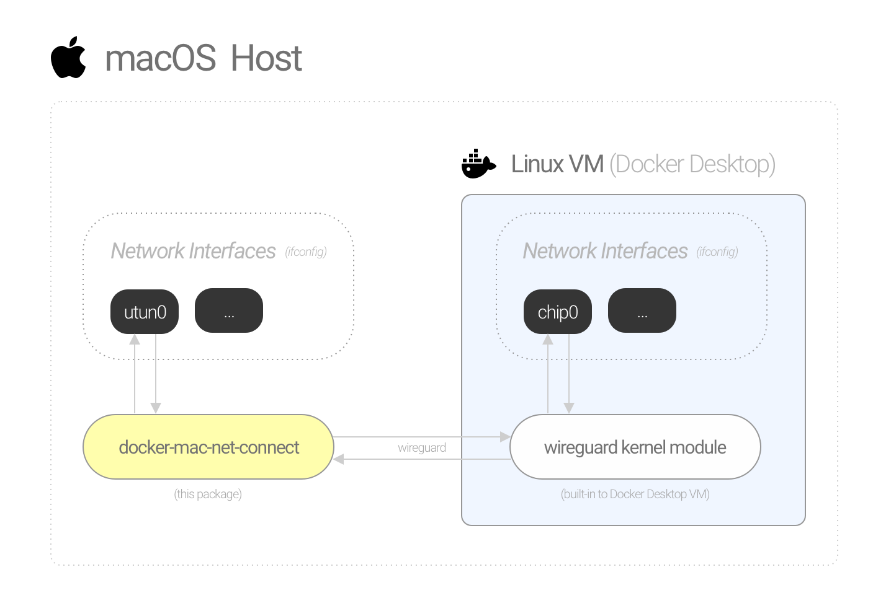

# Docker Mac Net Connect

> Connect directly to Docker-for-Mac containers via IP address.

## Features

- **L3 connectivity:** Connect to Docker containers from macOS host (without port binding).
- **Kubernetes support:** Automatically routes pod and service CIDRs when local k8s is detected (Docker Desktop k8s, Colima/k3s).
- **Lightweight:** Based on WireGuard (built-in to Linux kernel).
- **Hands-off:** Install once and forget. No need to re-configure every time you restart your Mac or Docker daemon.
- **Automatic:** Docker networks and Kubernetes CIDRs are automatically added/removed from macOS routing table.
- **No bloat:** Everything is handled by a single binary. No external dependencies/tools are needed.

## Requirements

One of the following Docker runtimes:

- **Docker Desktop** v3.6.0 or higher (see [#10](https://github.com/chipmk/docker-mac-net-connect/issues/10#issuecomment-1146662058))
- **Colima** (likely other Lima-based runtimes as well, but not tested)

## Installation

```bash
# Install via Homebrew
$ brew install chipmk/tap/docker-mac-net-connect

# Run the service and register it to launch at boot
$ sudo brew services start chipmk/tap/docker-mac-net-connect
```

### `GOPROXY` support

This Homebrew formulae is built using `go`. When Homebrew installs a formulae, it strips away local environment variables and configuration, including configuration set using `go env`.

Some users require changing `GOPROXY` due to firewalls. This formulae adds special support for `GOPROXY` using `HOMEBREW_GOPROXY`:

```bash
HOMEBREW_GOPROXY=https://my-proxy-url brew install chipmk/tap/docker-mac-net-connect
```

## Usage

After installing, you will be able to do this:

```bash
# Run an nginx container
$ docker run --rm --name nginx -d nginx

# Get the internal IP for the container
$ docker inspect nginx --format '{{.NetworkSettings.IPAddress}}'
172.17.0.2

# Make an HTTP request directly to its IP
$ curl -I 172.17.0.2
HTTP/1.1 200 OK
Server: nginx/1.21.3
Date: Thu, 11 Nov 2021 21:00:37 GMT
Content-Type: text/html
Content-Length: 615
Last-Modified: Tue, 07 Sep 2021 15:21:03 GMT
Connection: keep-alive
ETag: "6137835f-267"
Accept-Ranges: bytes
```

## Background

Accessing containers directly by IP (instead of port binding) can be useful and convenient.

### Problem

Unlike Docker on Linux, Docker-for-Mac does not expose container networks directly on the macOS host. Docker-for-Mac works by running a Linux VM under the hood (using [`hyperkit`](https://github.com/moby/hyperkit)) and creates containers within that VM.

Docker-for-Mac supports connecting to containers over Layer 4 (port binding), but not Layer 3 (by IP address).

### Solution

Create a minimal network tunnel between macOS and the Docker Desktop Linux VM. The tunnel is implemented using WireGuard.

### Why WireGuard?

WireGuard is an extremely lightweight and fast VPN. It’s also built in to the Linux kernel, which means no background processes/containers are required. It is the perfect tool for this application.

## How does it work?



### macOS side

A lightweight customized WireGuard server (_`docker-mac-net-connect`_) runs on your macOS host and creates a virtual network interface (`utun`) that acts as the link between your Mac and the Docker Desktop Linux VM.

### Linux VM side

Since WireGuard is built into the Linux kernel, all we need to do is configure the VM with a virtual network interface that links to the macOS host. No background processes or containers are required.

How do we configure the VM? A one-time container is deployed with just enough privileges to configure the Linux host’s network interfaces (`—-cap-add=NET_ADMIN` + `-—net=host`).

The container creates the interface, configures WireGuard, then exits and is destroyed. The WireGuard interface continues working after the container is gone because it was created on the Linux host’s network namespace, not the container’s.

### Tying it together

The server on macOS monitors your Docker container networks and automatically adds their subnets to your macOS routing table (routing through the `utun` interface). Now you can connect to any container directly by it’s IP address from your macOS host. Eg.

```bash
# Run an nginx container
$ docker run --rm --name nginx -d nginx

# Get the internal IP for the container
$ docker inspect nginx --format '{{.NetworkSettings.IPAddress}}'
172.17.0.2

# Make an HTTP request directly to its IP
$ curl -I 172.17.0.2
HTTP/1.1 200 OK
Server: nginx/1.21.3
Date: Thu, 11 Nov 2021 21:00:37 GMT
Content-Type: text/html
Content-Length: 615
Last-Modified: Tue, 07 Sep 2021 15:21:03 GMT
Connection: keep-alive
ETag: "6137835f-267"
Accept-Ranges: bytes
```

## Internal Docker Networks

Docker's [internal networks](https://docs.docker.com/reference/cli/docker/network/create/#internal) allow containers to communicate with each other while blocking access to external networks. They are supported out of the box - you can reach containers on internal networks from your macOS host just like any other container.

```bash
# Create an internal network
$ docker network create --internal --subnet 172.30.0.0/24 my-internal

# Run a container on it
$ docker run --rm -d --name nginx --network my-internal --ip 172.30.0.2 nginx

# Connect directly from macOS
$ curl -I 172.30.0.2
HTTP/1.1 200 OK
```

Under the hood, your macOS host's WireGuard IP is translated (NAT) to the Docker bridge gateway IP so that the container sees the traffic as coming from within its own network. This is necessary because internal networks intentionally have no default gateway - without NAT, the container would have no route to send replies back to the host.

This is safe because only your local macOS host can reach internal containers through the tunnel. Other devices on your LAN cannot reach them unless you have explicitly enabled IP forwarding on your Mac (which is off by default). Even then, LAN traffic is not NAT'd, so the container has no route to reply - effectively making internal containers unreachable from the LAN.

## Kubernetes

If you have Kubernetes enabled in Docker Desktop or running via Colima, `docker-mac-net-connect` automatically detects it and routes pod and service CIDRs through the tunnel. No configuration needed.

```bash
# Deploy a pod
$ kubectl run nginx --image=nginx:alpine

# Connect directly to the pod IP from macOS
$ curl -I $(kubectl get pod nginx -o jsonpath='{.status.podIP}')
HTTP/1.1 200 OK

# Service ClusterIPs work too
$ kubectl expose pod nginx --port=80 --name=nginx-svc
$ curl -I $(kubectl get svc nginx-svc -o jsonpath='{.spec.clusterIP}')
HTTP/1.1 200 OK
```

### How it works

The server reads your Docker and kubeconfig contexts at startup and pins them for the session. It monitors:

- **Pod CIDRs** - discovered from Node `spec.podCIDR` fields via the Kubernetes API. On Docker Desktop (which doesn't set `spec.podCIDR`), pod CIDRs are discovered from the VM's routing table instead.
- **Service CIDRs** - discovered from the ServiceCIDR API (k8s 1.33+)

Routes are added/removed automatically as CIDRs change.

### Supported configurations

Docker Desktop supports two cluster modes: **Kubeadm** (single-node, the default) and **kind** (multi-node). Both are supported.

| Runtime                  | Pod routing | Service routing |
| ------------------------ | ----------- | --------------- |
| Docker Desktop (Kubeadm) | Yes         | Yes             |
| Docker Desktop (kind)    | Yes         | Yes             |
| Colima (k3s)             | Yes         | Yes             |

Service CIDR routing requires the ServiceCIDR API (k8s 1.33+). On older versions, pod routing still works but service ClusterIPs won't be routable.

### Context pinning

The Docker and kubeconfig contexts are snapshotted once at startup (or when Docker Desktop restarts) and stay fixed for the session. If you switch Docker or Kubernetes contexts later, the service won't pick up the change automatically - you'll need to restart it.

We chose this approach to keep the Docker and Kubernetes contexts coupled together - if they drifted independently mid-session, the service could end up routing CIDRs from one cluster through the wrong Docker runtime's tunnel. In practice this is an edge case since most setups use a single runtime, but it's worth knowing about if you switch between Docker Desktop and Colima. In the future we may add support for setting the contexts via a config file so that you don't have to rely on the correct contexts being active at startup.

## Accessing Containers from the LAN

By default, `docker-mac-net-connect` enables your macOS host to reach containers directly by IP. With some additional configuration, other devices on your local network can reach containers too.

### Prerequisites

1. **Enable IP forwarding on your Mac.** This allows your Mac to forward packets from the LAN into the WireGuard tunnel:

   ```bash
   sudo sysctl -w net.inet.ip.forwarding=1
   ```

   To persist across reboots, add `net.inet.ip.forwarding=1` to `/etc/sysctl.conf`.

2. **Add a static route on your router.** Route your Docker network subnet(s) through your Mac's LAN IP. For example, if your Mac's LAN IP is `192.168.1.6` and your Docker network uses `192.168.2.0/24`:

   ```
   Network: 192.168.2.0
   Netmask: 255.255.255.0
   Gateway: 192.168.1.6
   ```

   Not all routers support static routes - you may need one that supports OpenWRT or similar.

### How it works

Traffic from LAN devices is forwarded through the WireGuard tunnel without NAT, so containers see the real source IP of each device. This is useful for services like Pi-hole that need to identify individual clients.

## Other Solutions

Other great solutions have been created to solve this, but none of them are as turn-key and lightweight as we wanted.

- **[docker-tuntap-osx](https://github.com/AlmirKadric-Published/docker-tuntap-osx)**
  - Requires installing third party `tuntap` kernel extension
  - Requires manually re-running a script every time the Docker VM restarts to bring the network interface back up
  - Docker network subnets have to be routed manually

- **[docker-mac-network](https://github.com/wojas/docker-mac-network)**
  - Requires installing an OpenVPN client (ie. `Tunnelblick`)
  - Requires an OpenVPN server container to be running at all times in order to function
  - Docker network subnets have to be routed manually

## FAQ

### Is this secure?

This tool piggybacks off of WireGuard which has gone through numerous audits and security tests (it is built-in to the Linux kernel after all). The `docker-mac-net-connect` server generates new private/public key pairs for each WireGuard peer every time it runs. The WireGuard listen port is also ephemeral - no values are hard-coded.

Network traffic runs directly between the macOS host and local Linux VM - no external connections are made.

### Can I use this in production?

This tool was designed to assist with development on macOS. Since Docker-for-Mac isn't designed for production workloads, neither is this.

### What happens if Docker Desktop restarts?

The server detects when the Docker daemon stops and automatically reconfigures the tunnel when it starts back up. If Kubernetes is enabled, pod and service CIDR routes are also re-added.

### Do you add/remove routes when Docker networks change?

Yes, the server watches the Docker daemon for both network creations and deletions and will add/remove routes accordingly. Kubernetes pod and service CIDRs are also watched and routed automatically.

For example, let's create a Docker network with subnet `172.200.0.0/16`:

```bash
# First validate that no route exists for the subnet
sudo netstat -rnf inet | grep 172.200

# Create the docker network
$ docker network create --subnet 172.200.0.0/16 my-network

# Check the routing table - a new route exists
$ sudo netstat -rnf inet | grep 172.200
172.200            utun0              USc          utun0

# Remove the docker network
$ docker network rm my-network

# The route has been removed
sudo netstat -rnf inet | grep 172.200
```

### Will routes remain orphaned in the routing table if the server crashes?

No, routes are tied to the `utun` device created by the server. If the server dies, the `utun` interface will disappear along with its routes.

### Why does the service need to run as root?

Root permissions are required by the service to:

- Create a `utun` network interface
- Configure the `utun` interface (`ifconfig`)
- Add and remove routes in the routing table (`route`)

This app tries to minimize opportunity for privilege escalation by following the principle of least privilege (PoLP). With that said, macOS has no concept of fine-grained admin privileges (ie. capabilities), so running as `sudo` is required.

## Troubleshooting

- If things stop working after upgrading Docker, you may need to do a clean uninstall / reinstall of Docker Desktop. See here for uninstall instructions: [Uninstall Docker](https://docs.docker.com/desktop/uninstall/)
- For general troubleshooting, try running the command directly rather than as a service: (From e.g. `/opt/homebrew/Cellar/docker-mac-net-connect/v{*.*}/bin/`):

```
sudo brew services stop chipmk/tap/docker-mac-net-connect
sudo docker-mac-net-connect
```

This will show any debug messages that may indicate what is causing your issue.

- **Kubernetes connections not working?** Your kubeconfig context must match your Docker runtime. For example, if you're using Docker Desktop, your kube context should be `docker-desktop`. If you're using Colima, it should be `colima`. The kube context is snapshotted when the service starts - if they were mismatched at startup, fix both contexts and restart the service:

```bash
# Set the correct kube context
kubectl config use-context docker-desktop

# Restart the service
sudo brew services restart chipmk/tap/docker-mac-net-connect
```

## License

MIT
